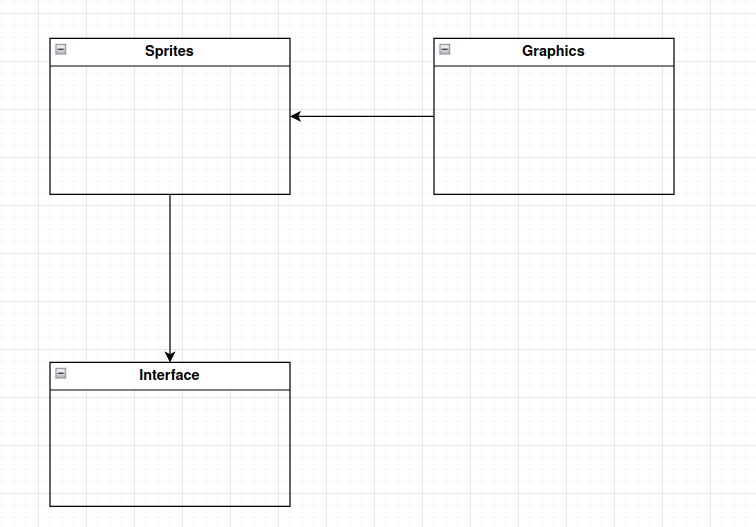

# Arkkitehtuuri

## Rakenne

## Käyttöliittymä

Luokka [Interface](../src/interface.py) vastaa tasovalinnan näkymästä. Pelin varsinaisten tasojen luominen löytyy luokasta [MatchingGame](../src/run_game.py).

## Sovelluslogiikka 

Luokka [LevelMap](../src/level.py) vastaa jokaisen tason pohjakartan luonnista ja korttien järjestyksen sekoituksesta. Luokka [MatchingGame](../src/run_game.py) vastaa pelin suorituksesta ja pisteiden tallennuksesta. Pisteet tallennetaan pickle-tiedostoihin.

## Ohjelman rakenteen heikkoudet

Koodin käyttöliittymä ja sovelluslogiikka ovat liian sekaisin keskenään. Lisäksi luokan [MatchingGame](../src/run_game.py) toimintoja olisi voinut jakaa useampiin osiin.