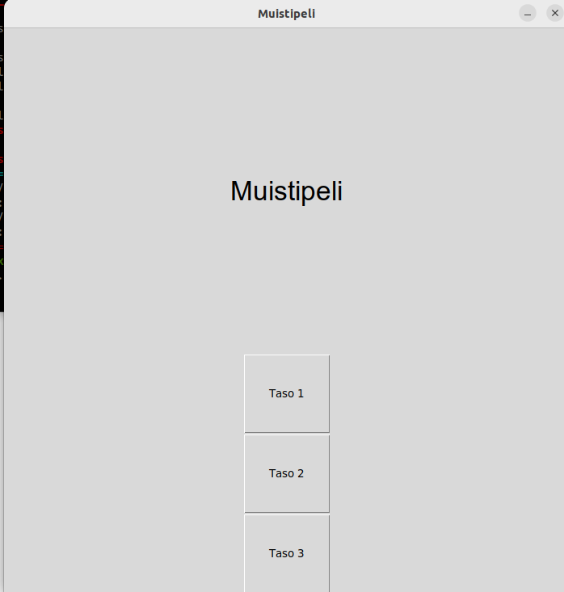
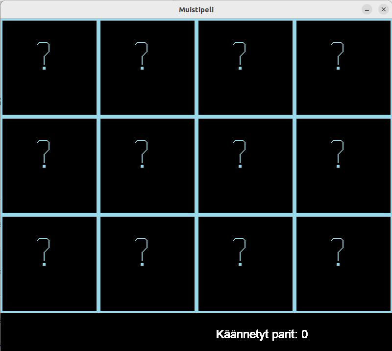

# Käyttöohje

## Ohjelman asennus ja käynnistys

Ennen ensimmäistä käynnistystä asenna riippuvuudet komennolla:

```bash
poetry install
```

Nyt sovellus käynnistyy komennolla:

```bash
poetry run invoke start
```

## Käyttö

Ensimmäisenä avautuu sivu, josta haluttu taso avataan nappia painamalla. Helpoin taso on 1 ja haastavin 3. 



Kun haluttu taso on avattu, peliä pelataan klikkaamalla kaksi korttia ympäri hiirellä. Kortit kääntyvät hetken päästä itsestään ympäri, kun hiirtä liikuttaa toisen kortin klikkaamisen jälkeen. Sivun alalaidassa oleva laskuri näyttää pelaajan yhteensä kääntämät korttiparit. Kun pelaaja avaa kaksi samaa kuvaa sisältävää korttia, ne poistuvat ruudulta. Pelin tavoitteena on poistaa kaikki kortit ruudulta ja saada tulokseksi mahdollisimman pieni luku, joka on kuitenkin vähintään sama kuin korttiparien määrä. 

