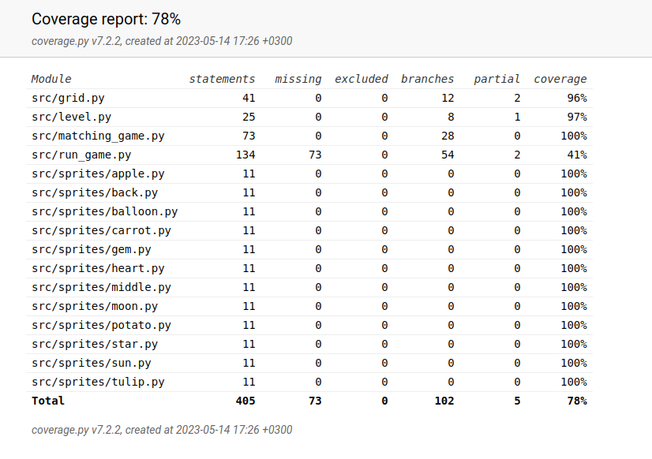

# Testausdokumentti

Ohjelmaa on testattu sekä unittestin avulla että manuaalisesti.

## Unittest

### Sovelluslogiikka

Muistipelin pohjan luontia testataan luokan [TestGrid](../src/tests/grid_size_test.py) avulla. Luokka testaa, että jokainen taso luodaan oikean kokoiseksi.

### Pisteiden tallennus

Pelaajan pisteiden tallentumista testataan luokan [TestScores](../src/tests/scores_test.py) avulla. 

### Testauskattavuus
Testauskattavuudeksi tuli kokonaisuudessaan 78%, mutta varsinaisen ohjelman koodin testauskattavuudeksi jäi vain 48%. Testaamatta jäivät kohdat koodista, jossa käyttöliittymä ja muu koodi ovat sekaisin.

## Järjestelmätestaus

Järjestelmätestausta on suoritettu manuaalisesti.

### Toiminnallisuus

Jokaisen tason toimivuus on testattu. Sovellus ei lue käyttäjän luomia syötteitä, vaan pelkästään hiiren liikkeitä, joten käyttäjän toiminta ei voi juuri saada aikaan virhetilanteita.

## Ratkaisemattomat ongelmat

 - Kun kaksi korttia on käännetty, ne kääntyvät itsestään takaisin 2,5 sekunnin päästä. Tämä ajastin on kuitenkin tällä hetkellä sidoksissa näppäimistön tai hiiren tapahtumiin. Kortit eivät siis käänny takaisin ympäri, ellei käyttäjä liikuta hiirtä tai paina jotakin hiiren tai näppäimistön painiketta.
 - Sovelluksen käyttöliittymä ja muu koodi jäivät melko sekaisin keskenään. Tämä johti ongelmiin saada sopivia yksikkötestejä luotua. Ohjelman rakenteen olisi voinut suunnitella alusta asti enemmän erilleen.